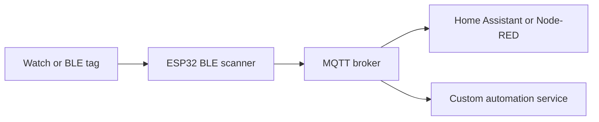

# ESP32 Bluetooth Watch Scanner → MQTT
Presence / Proximity building block for room-based home automation

This project turns an **ESP32** into a small BLE scanner that detects nearby Bluetooth devices (watches/tags) **without pairing**, reads **RSSI** (signal strength), and publishes scan results to **MQTT**.

The intended usage is **room-level presence/proximity automation**: place one ESP32 per room, then trigger lights/TV/etc. when a known watch enters a room, and turn things off when nobody remains.

---

## Why this exists

Many Bluetooth watches and tags continuously emit advertisement packets (beacon-like signals). You can use those broadcasts as a lightweight “presence signal”:

- No pairing required
- You can identify devices via their **MAC address**
- RSSI provides a rough proximity estimate (near/far)

> Important: RSSI is noisy. Use smoothing, thresholds, and timeouts in your automation logic.

---

## How it works

1. ESP32 connects to Wi‑Fi.
2. ESP32 connects to an MQTT broker.
3. ESP32 performs active BLE scans every few seconds.
4. Each scan result publishes a JSON array of items containing **MAC + RSSI**.
5. Your automation layer consumes MQTT messages and decides:
   - “someone entered this room”
   - “room became empty for N minutes”
   - “turn on/off lights or other devices”

---

## Architecture



---

## Hardware

- ESP32 (any board supported by Arduino-ESP32)
- A BLE beacon source:
  - smartwatch
  - BLE tag
  - phone (if advertising)
- Wi‑Fi network
- MQTT broker (e.g., Mosquitto)

Recommended real-world setup:
- **One ESP32 per room** (or per zone)
- Central MQTT broker (local NAS/RPi/home server)

---

## MQTT topics and payloads

The refactored sketch derives topics from `hostName`:

- **BLE scan batches:** `<hostName>/response`
- **IP query request:** `<hostName>/getip`
- **IP query response:** `<hostName>/ip`

### BLE scan payload (published to `<hostName>/response`)

The sketch publishes scan results in **chunks** (to keep payloads small).  
Each message is a JSON array like:

```json
[
  {"Address":"AA:BB:CC:DD:EE:FF","Rssi":-62},
  {"Address":"11:22:33:44:55:66","Rssi":-78}
]
```

### IP discovery

Publish:
- topic: `<hostName>/getip`
- payload: `showip`

Device responds on `<hostName>/ip`:
- payload: `<hostName> ==> <ip>`

> Tip: If you prefer a single global topic like `home/presence/ble`, you can change the topic construction in code (see “Customization”).

---

## Configure

Edit `config.h`.

A minimal example:

```cpp
#pragma once

#define WIFI_SSID      "YourSSID"
#define WIFI_PASSWORD  "YourPassword"
#define MQTT_ADDRESS   "192.168.1.10"

// Unique name per room/device
static const char* hostName = "presence-livingroom";

// LED pin (board dependent)
constexpr uint8_t LedPin = 2;

// BLE scan duration
constexpr uint16_t scanTimeSeconds = 5;

// Optional: override MQTT port
// #define MQTT_PORT 1883
```

---

## Build & flash

### Arduino IDE
1. Install **Arduino-ESP32** core.
2. Select your ESP32 board + COM port.
3. Flash the sketch.

### PlatformIO
Works fine with PlatformIO as well; add libraries:
- `PubSubClient`
- ArduinoOTA (part of the ESP32 core)
- ESP32 BLE libraries (part of the ESP32 core)

---

## OTA updates

OTA is enabled. Once the device is on the same network, you can upload via OTA using the device hostname (`hostName`).

> For production, consider adding OTA password protection.

---

## Room automation logic (recommended)

### Presence detection (enter)
- Keep a whitelist of known MAC addresses (household devices).
- If a whitelisted MAC appears with RSSI above a threshold (example: `>-75`) for a few consecutive scans:
  - mark “present in room”
  - trigger actions: lights on, TV on, etc.

### Leaving (room empty)
- For each room, maintain a “last seen timestamp” per MAC.
- If **no known MAC** has been seen for `X` minutes:
  - mark room empty
  - turn off lights/TV/heaters/etc.

Practical values:
- Scan every 5–10s
- Enter: 2–3 consecutive detections
- Exit timeout: 2–10 minutes (depends on your home layout)

---

## Reliability notes (RSSI reality)

RSSI varies a lot due to:
- body position, walls, reflections
- watch orientation
- different device antenna characteristics

To make it stable:
- apply a moving average / median filter
- use hysteresis (different enter/exit thresholds)
- decide based on *multiple scans*, not a single packet

---

## Safety and privacy

- Do **not** track people without explicit consent.
- MAC addresses are identifiers. Treat them as sensitive data.
- Keep MQTT on your local network, lock down broker access (auth + ACLs).

---

## Customization ideas

### Separate topics for status vs scan data
Currently both can be published under `<hostName>/response`.  
For cleaner consumers, split into:
- `<hostName>/status` (retained)
- `<hostName>/ble` (scan batches)

### Publish one JSON object per device
If you prefer:
```json
{"mac":"AA:BB:CC:DD:EE:FF","rssi":-62,"room":"livingroom"}
```
Change the scan publish function to publish one message per device, or publish a compact aggregated JSON object.

### Device filtering
Add filters in the BLE callback:
- RSSI threshold
- known MAC list
- name prefix

---

## Troubleshooting

- **No devices found**
  - Ensure the watch/tag is advertising.
  - Try active scan and increase `scanTimeSeconds`.
- **MQTT not connecting**
  - Verify broker IP and port.
  - Check Wi‑Fi reachability and firewall.
- **OTA not visible**
  - Ensure the PC and ESP32 are on the same subnet.
  - Check that the device is not stuck in Wi‑Fi reconnect loops.

---

## License

Add a `LICENSE` file (MIT/Apache-2.0/etc.) and reference it here.


